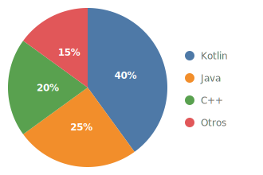
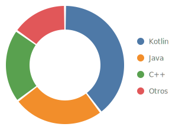
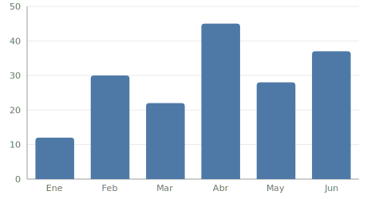
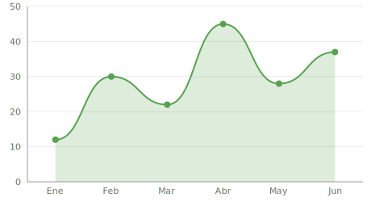

# Compose PieChart Library

[](https://github.com/ricardomorarey/Compose-Piechart-library/actions/workflows/build.yml)
[](https://jitpack.io/#ricardomorarey/Compose-Piechart-library)
[](LICENSE)

A lightweight, animated chart library for **Jetpack Compose** — **pie / donut charts**, **bar charts** and **line charts** with X/Y axes — written 100% in Kotlin with no third-party dependencies.

## Preview

| Pie chart | Donut chart |
|:---:|:---:|
|  |  |

**Bar chart with X/Y axes**



**Line chart (smooth, with filled area)**



## Features

**PieChart**
- 🥧 Pie and donut modes (configurable hole ratio)
- 🎬 Animated sweep on first display and on data changes
- 👆 Click handling per slice
- 🏷️ Optional percentage labels (auto-hidden on tiny slices)
- ↔️ Configurable start angle and spacing between slices

**BarChart**
- 📊 Vertical bars with X and Y axes
- 📏 Automatic "nice" rounded Y-axis scale (or a fixed maximum)
- 🌫️ Optional grid lines, axis values, per-bar labels (with ellipsis) and values above bars
- 🎬 Animated bar growth and click handling per bar
- 🎨 Per-bar colors, rounded corners and maximum bar width in dp
- 🔦 Selection highlighting (dims the non-selected bars)

**LineChart**
- 📈 Straight or smooth curved line with X and Y axes
- 🌊 Optional filled area under the line and dots at each point
- 🎬 Animated left-to-right reveal and click handling per point

**All charts**
- 🎨 Built-in colorblind-friendly palette
- ♿ Accessible by default: auto-generated content descriptions for screen readers (TalkBack), customizable via `contentDescription`
- 📦 Min SDK 21, no dependencies beyond Compose itself

## Installation

Add JitPack to your repositories (`settings.gradle.kts`):

```kotlin
dependencyResolutionManagement {
    repositories {
        google()
        mavenCentral()
        maven("https://jitpack.io")
    }
}
```

Add the dependency:

```kotlin
dependencies {
    implementation("com.github.ricardomorarey:Compose-Piechart-library:1.2.0")
}
```

## Usage

### Basic pie chart

```kotlin
val slices = listOf(
    PieSlice(value = 40f, color = PieChartDefaults.colorFor(0), label = "Kotlin"),
    PieSlice(value = 25f, color = PieChartDefaults.colorFor(1), label = "Java"),
    PieSlice(value = 20f, color = PieChartDefaults.colorFor(2), label = "C++"),
    PieSlice(value = 15f, color = PieChartDefaults.colorFor(3), label = "Other"),
)

PieChart(
    slices = slices,
    modifier = Modifier.size(220.dp),
)
```

### Donut chart with labels and click handling

```kotlin
PieChart(
    slices = slices,
    modifier = Modifier.size(220.dp),
    style = PieChartStyle(
        holeRatio = 0.6f,              // 0 = pie, up to 0.95 = thin ring
        sliceSpacingDegrees = 2f,      // gap between slices
        startAngleDegrees = -90f,      // start at 12 o'clock
        showPercentageLabels = true,
    ),
    onSliceClick = { slice -> println("Clicked: ${slice.label}") },
)
```

### Bar chart with X/Y axes

```kotlin
val entries = listOf(
    BarEntry(value = 12f, label = "Jan"),
    BarEntry(value = 30f, label = "Feb"),
    BarEntry(value = 22f, label = "Mar"),
    BarEntry(value = 45f, label = "Apr", color = Color(0xFFE15759)), // per-bar color
)

BarChart(
    entries = entries,
    modifier = Modifier.fillMaxWidth().height(220.dp),
    style = BarChartStyle(
        barColor = PieChartDefaults.colorFor(0),
        yTickCount = 5,            // Y-axis divisions (auto "nice" scale)
        barSpacingRatio = 0.3f,    // gap around each bar
        barMaxWidth = 48.dp,       // cap the bar width in dp (optional)
        showValues = true,         // draw each value above its bar
        showGridLines = true,
    ),
    selectedIndex = selectedIndex, // highlights one bar, dims the rest (optional)
    onBarClick = { entry -> println("Clicked: ${entry.label}") },
)
```

### Line chart

```kotlin
LineChart(
    points = listOf(
        LinePoint(value = 12f, label = "Jan"),
        LinePoint(value = 30f, label = "Feb"),
        LinePoint(value = 22f, label = "Mar"),
        LinePoint(value = 45f, label = "Apr"),
    ),
    modifier = Modifier.fillMaxWidth().height(220.dp),
    style = LineChartStyle(
        lineColor = PieChartDefaults.colorFor(2),
        smooth = true,     // curved line instead of straight segments
        fillArea = true,   // filled area under the line
        showPoints = true, // dot at each data point
    ),
    onPointClick = { point -> println("Clicked: ${point.label}") },
)
```

### Accessibility

All charts expose a content description to screen readers (TalkBack). By default it
is generated from the data — e.g. `"Kotlin: 40%; Java: 25%"` — and you can replace
it with your own text:

```kotlin
PieChart(
    slices = slices,
    modifier = Modifier.size(220.dp),
    contentDescription = "Language usage: Kotlin 40 percent, Java 25 percent",
)
```

### Customizing the animation

```kotlin
PieChart(
    slices = slices,
    modifier = Modifier.size(220.dp),
    animationSpec = tween(durationMillis = 1500, easing = LinearOutSlowInEasing),
)
```

## API overview

| Type | Description |
|---|---|
| `PieChart` | Pie / donut chart composable |
| `PieSlice(value, color, label)` | One slice of data |
| `PieChartStyle` | Pie visual configuration (hole ratio, spacing, start angle, labels) |
| `BarChart` | Bar chart composable with X/Y axes |
| `BarEntry(value, label, color)` | One bar of data |
| `BarChartStyle` | Bar visual configuration (axis, grid, spacing, corners, values, max width) |
| `LineChart` | Line chart composable with X/Y axes |
| `LinePoint(value, label)` | One point of data |
| `LineChartStyle` | Line visual configuration (smoothing, area fill, points, axis) |
| `PieChartDefaults` | Colorblind-friendly default palette |

## Sample app

The [`sample`](sample/) module contains a demo app showing a pie chart, a donut chart, a bar chart with selection, a line chart and a legend. Open the project in Android Studio and run the `sample` configuration.

## License

```
MIT License — Copyright (c) 2026 Ricardo Mora Rey
```

See [LICENSE](LICENSE) for details. This library is an original implementation; it does not include code from other charting libraries.
